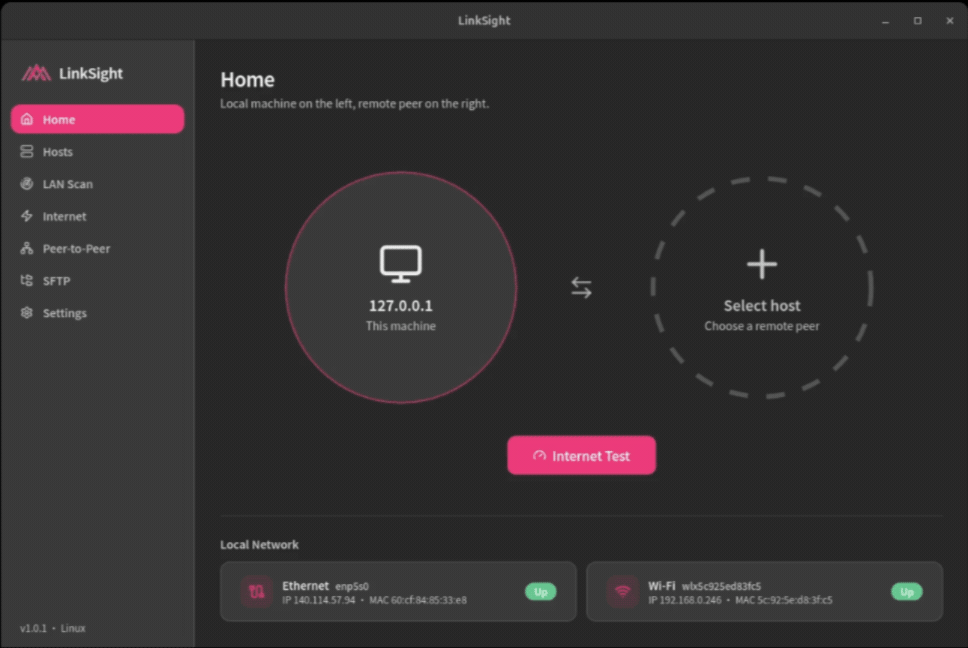
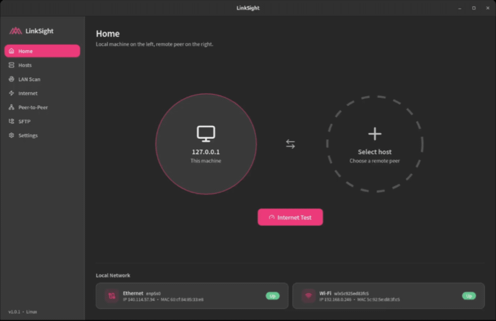
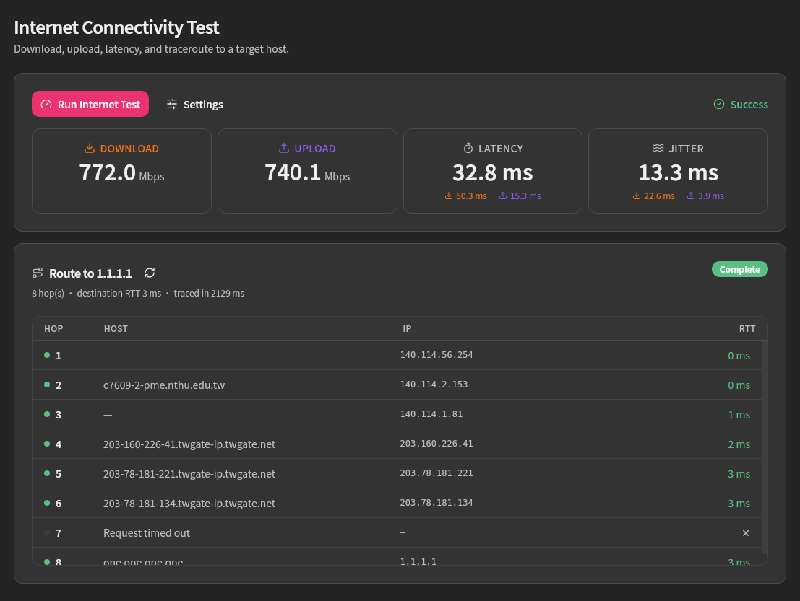
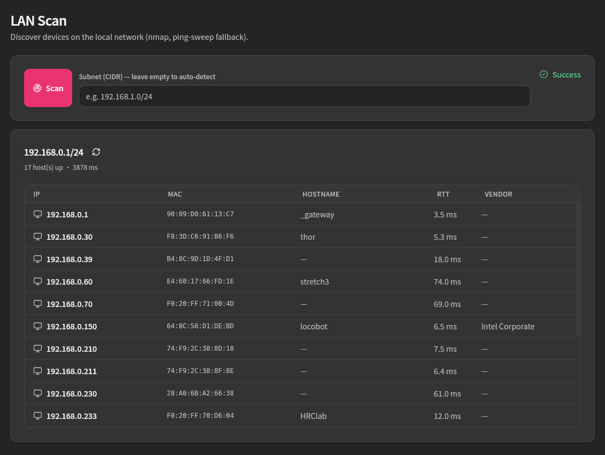
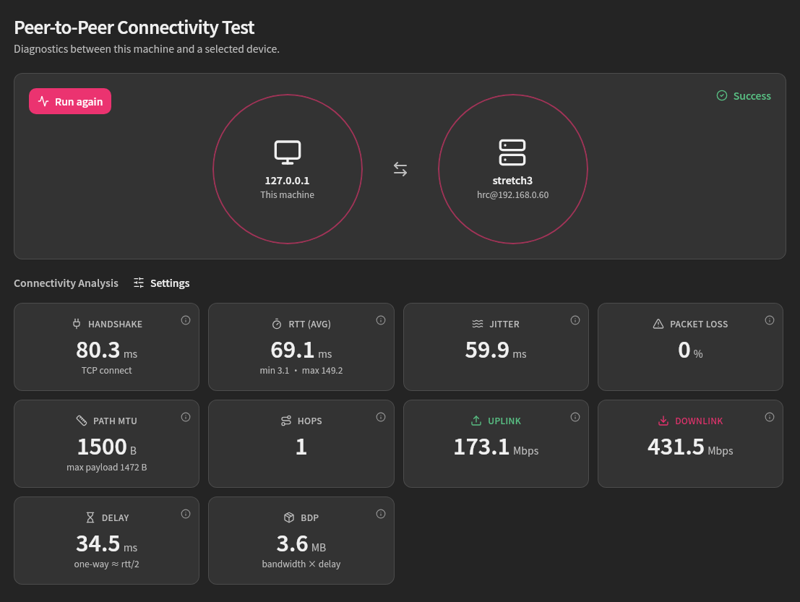
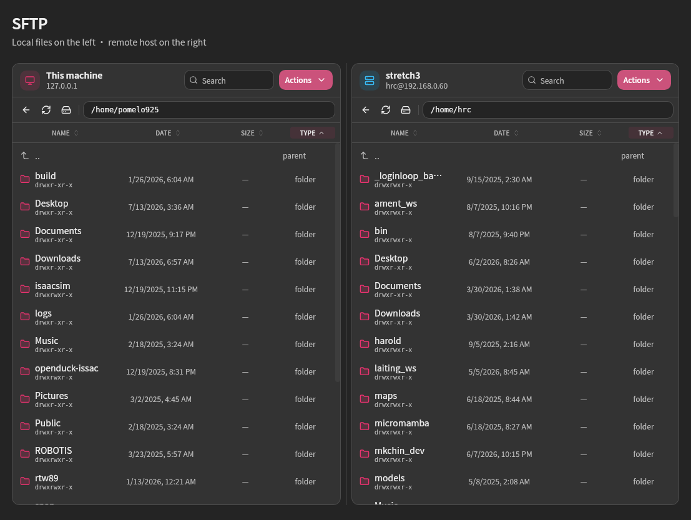
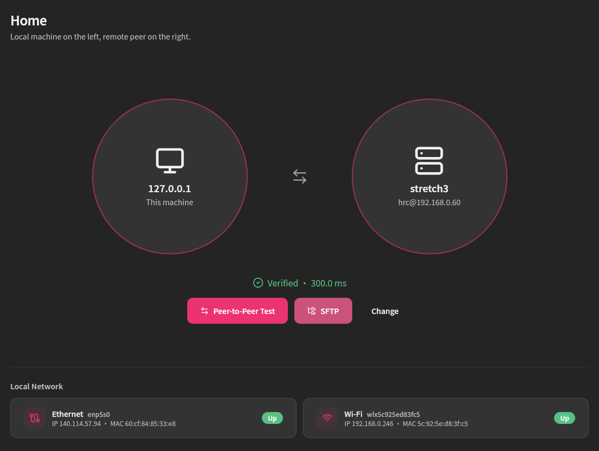
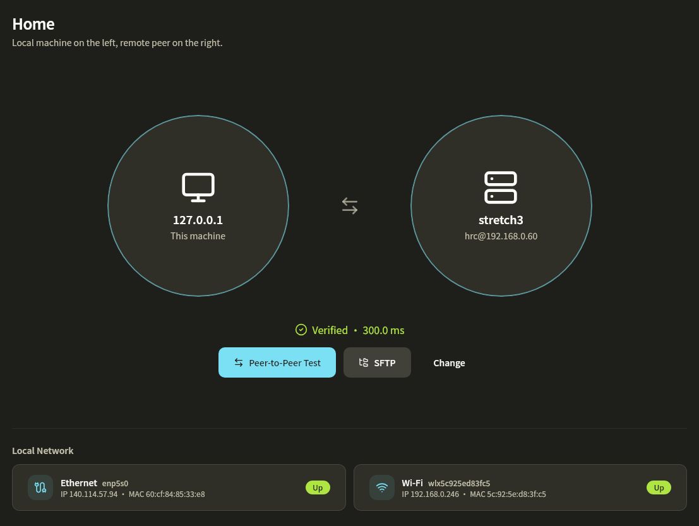
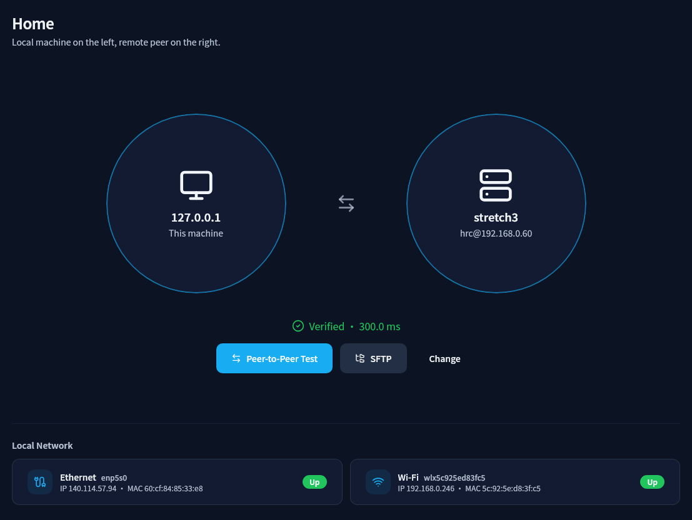
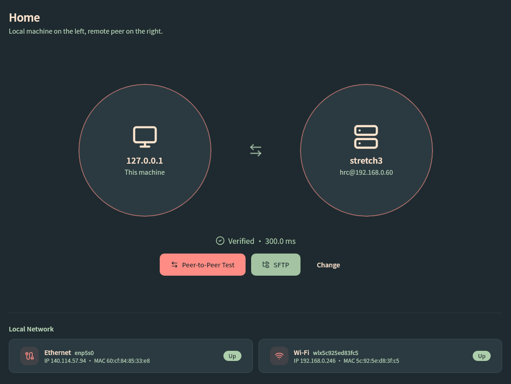

<div align="center">


# LinkSight

A lightweight desktop app for quick **single-host internet** and **two-host peer** connectivity checks.

[中文](README.md) · [English](README-en.md)

[](https://github.com/pomelo925/LinkSight/releases/latest)
[](LICENSE)

<table>
  <tr>
    <td align="center" width="50%">
      <strong>Internet Connectivity</strong><br />
      
    </td>
    <td align="center" width="50%">
      <strong>Peer-to-Peer</strong><br />
      
    </td>
  </tr>
</table>

</div>


<br /><br />

## 1. How to run

**Linux only** for now. Download from [Releases](https://github.com/pomelo925/LinkSight/releases/latest):

- **`.deb`** — Ubuntu / Debian. After install, it appears in your app list:

  ```bash
  sudo dpkg -i LinkSight_*.deb
  ```

  or:

  ```bash
  sudo apt install ./LinkSight_*.deb
  ```

- **`.AppImage`** — works on most distros:

  ```bash
  chmod +x LinkSight_*_amd64.AppImage
  ./LinkSight_*_amd64.AppImage
  ```

> Some distros (e.g. Ubuntu 22.04+) may need `libfuse2` to run AppImage.


<br /><br />

## 2. Features

<table>
  <tr>
    <td align="center" width="50%">
      <strong>Internet Connectivity</strong><br />
      
    </td>
    <td align="center" width="50%">
      <strong>LAN Scan</strong><br />
      
    </td>
  </tr>
  <tr>
    <td align="center" width="50%">
      <strong>Peer-to-Peer</strong><br />
      
    </td>
    <td align="center" width="50%">
      <strong>SFTP</strong><br />
      
    </td>
  </tr>
</table>

- **Internet Connectivity** — Test download / upload, latency, and route from this machine.
- **LAN Scan** — Discover devices on the local network.
- **Peer-to-Peer** — Diagnose connectivity quality between this machine and another host.
- **SFTP** — Browse and transfer files between local and remote hosts.

---

<div align="center">

### Theme colors

<table>
  <tr>
    <td align="center" width="50%">
      <strong>Rose Charcoal</strong><br />
      
    </td>
    <td align="center" width="50%">
      <strong>Monokai</strong><br />
      
    </td>
  </tr>
  <tr>
    <td align="center" width="50%">
      <strong>Slate Blue</strong><br />
      
    </td>
    <td align="center" width="50%">
      <strong>Watermelon</strong><br />
      
    </td>
  </tr>
</table>

</div>


<br /><br />

## 3. Development

Docker is the recommended development path:

```bash
./run.sh dev      # Start the container and launch the Tauri app (hot reload)
./run.sh shell    # Open a container shell (debugging)
./run.sh down     # Stop and remove the development container
```

Requires Docker, Docker Compose, and a working X server.


<br /><br />

## 4. Contribution

Contributions are welcome! See [CONTRIBUTING.md](CONTRIBUTING.md).

Main workflow: fork the repo → branch your changes → open a Pull Request.


<br /><br />

## 5. License

Distributed under the [MIT License](LICENSE).
